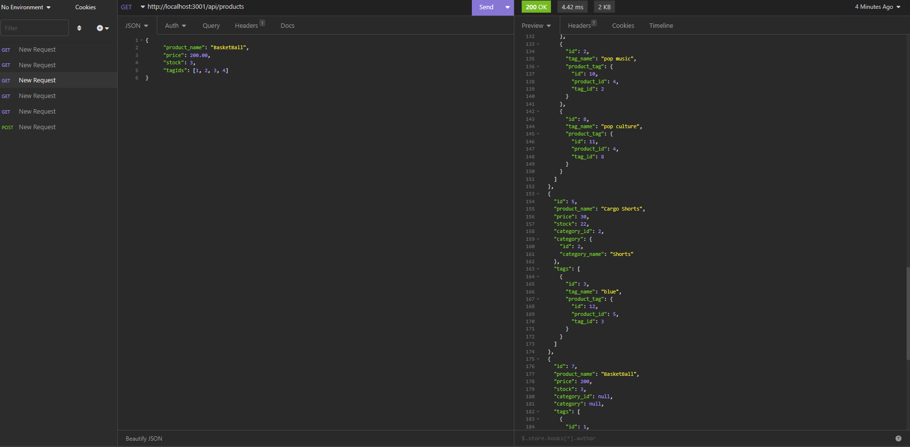

  # MSUBC_Module13_CH Store Backend by Mateusz Zielinski
  ## Description
  This program contains a simple backend database with endpoints for a store containing products, tags, and product categories
  
  
  ## License
  
  This application is not currently under any license agreement.
  ## Table of Contents
  - [License](#License)
  - [Usage](#Usage)
  - [Installation](#Installation)
  - [Testing](#Testing)
  - [Contributing](#Contributing)
  - [Tutorial](#Tutorial)
  ## Usage
  - open the project in vscode or another compatible editor
  - right click on 'schema.sql' and select 'open in integrated terminal'
  - login to mysql using 'mysql -u "user" -p', then enter the command 'source schema.sql', then 'quit'
  - now right click on 'server.js' and select 'open in integrated terminal'
  - in the command line type in 'npm i' then 'npm start' - now you can make requests using insomnia
  - endpoints are /products, /tags, /categories and contain getall, getone, post, put, and delete routes
  ## Installation
  - open gitbash
  - navigate to the desired parent folder 
  - type into gitbash 'git clone https://github.com/IMadeThisJustToPostThis/MSUBC_Module13_CH-Store-Backend.git'
  ## Testing
  no tests
  ## Contributing
  contibute however you want i don't care
  ## Questions
  Github:<https://github.com/IMadeThisJustToPostThis>
  
  Email: zielinm2@mail.lcc.edu
  ## Tutorial
  click on the image below to view the tutorial video
  
  